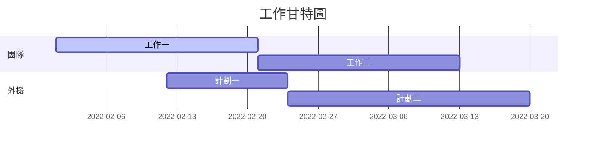
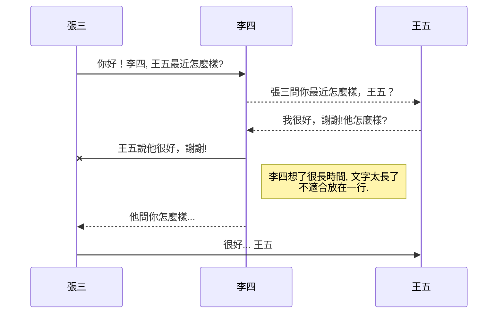
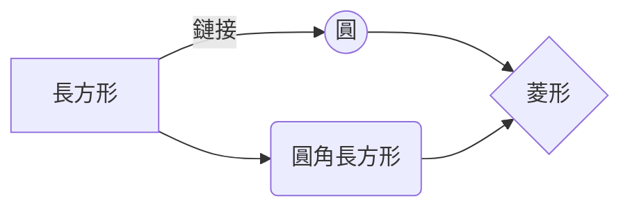
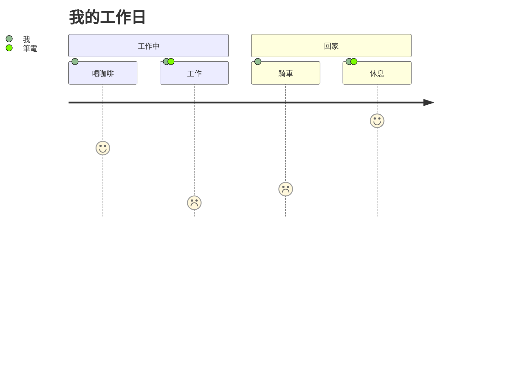
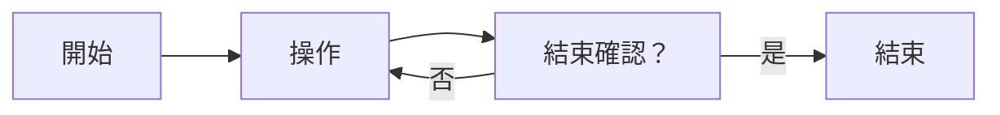

# 歡迎使用Markdown

> 記錄一下用得到的Markdown基本語法知識。

## 如何改變樣式

*斜體標記* `* 或 _`

**粗體標記** `** 或 __`

==強調標記==或<mark>強調標記</mark> `== 或 <mark>`

~~刪除標記~~ `~`

> 引文句標記 `>`

## 分割線

---
`---`
`***`
`___`

## 插入連結與圖片

連結: [連結](https://github.com/)

圖片: 
``

## 程式碼段落

句內卡程式碼如`printfn "%A" n`
> ``

```javascript
// 程式區塊
var foo = 'bar';
```

## 列表標記

- 沒編號列
  - 子項目
    - 子項目

1. 有編號列
   1. 子項目
2. 項目2
3. 項目3

- [ ] 任務標記
- [x] 完成任務

## 創建表格

簡單的表格：
 項目 | 價格  
 ---- | -----
 電腦 | $26000
 手機 | $12000  

### 設定欄置中、靠左、靠右

使用`:---------:`置中
使用`:----------`靠左
使用`----------:`靠右
| 第一欄 | 第二欄 | 第三欄 |
| :----: | -----: | :----- |
|  置中  |   靠右 | 靠左   |

### 設定欄位寬度

在格內加入div style設定寛度
`<div style="width:200px"></div>`

## 創建註脚

簡單的註脚。 [^1]

[^1]: 註腳的解釋

Markdown將文本轉換為 HTML。[^HTML]

[^HTML]: 超文字標記語言

## LaTeX數學公式

使用渲染LaTeX數學表達式 [KaTeX](https://khan.github.io/KaTeX/):

Gamma公式展示 $\Gamma(n) = (n-1)!\quad\forall n\in\mathbb N$ 是通過歐拉積分

$$
\Gamma(z) = \int_0^\infty t^{z-1}e^{-t}dt\,.
$$

- 關於[**LaTeX** 數學表達式][1].

## 甘特圖功能



- 關於[**甘特圖** 語法][2].

## UML 圖表

也可以使用UML圖表進行渲染產生一個序列圖：



以下產生一個流程圖。:



旅程圖：



- 關於[**Mermaid** 語法][3],

## FLowchart流程圖

也支持flowchart的流程圖：



- 關於[**Flowchart流程圖** 語法][4].

## 已測試過能完整支援的編輯器

- [VS Code加Markdown延伸模組](https://code.visualstudio.com/)
- [思源筆記](https://ld246.com/domain/siyuan)
- [VNote](https://vnotex.github.io/vnote/zh_cn/)
- [Joplin](https://joplinapp.org/)
- [CSDN editor](https://mp.csdn.net/mp_blog/creation/editor)
- [Zettlr](https://github.com/Zettlr/Zettlr)
- [Obsidian](https://obsidian.md/download)

[1]: http://meta.math.stackexchange.com/questions/5020/mathjax-basic-tutorial-and-quick-reference
[2]: https://mermaid-js.github.io/mermaid/#/gantt
[3]: https://mermaidjs.github.io/
[4]: http://adrai.github.io/flowchart.js/
